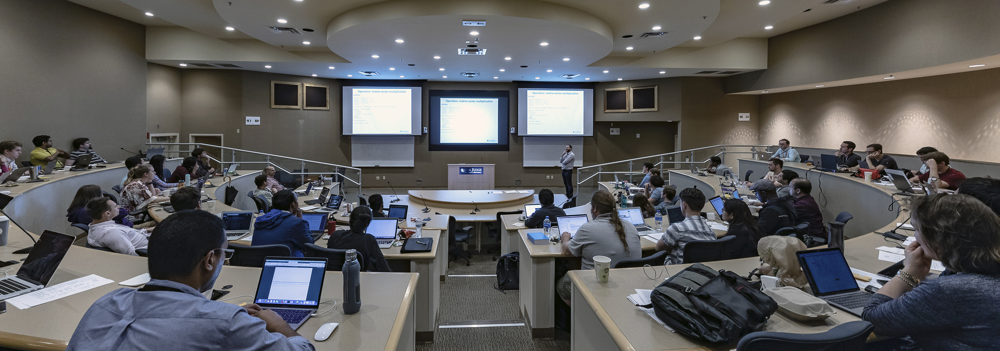

.. _training:

#########
Training
#########

The OLCF provides training to our users in a variety of ways. By following the links below, you can find upcoming training events, self-guided tutorials, slides and recordings from past training events, information on upcoming GPU hackathons, and the OLCF Vimeo channel.

.. toctree::
   :maxdepth: 1

   OLCF Training Calendar <https://www.olcf.ornl.gov/for-users/training/training-calendar>
   OLCF Tutorials <https://github.com/olcf-tutorials>
   training_archive
   olcf_gpu_hackathons
   OLCF Vimeo Channel <https://vimeo.com/channels/olcftraining>

New User Quick Start
---------------------

The New User Quick Start is a Git Repo with an outline that connects recordings of our new user training events with links to the appropriate sections in our user guide and a few self-guided hands-on exercises.

You will need to use your current OLCF project_ID in all the batch scripts for the hands-on exercises.

To get started click here:  `New User Quick Start Guide <https://github.com/olcf/NewUserQuickStart>`_
